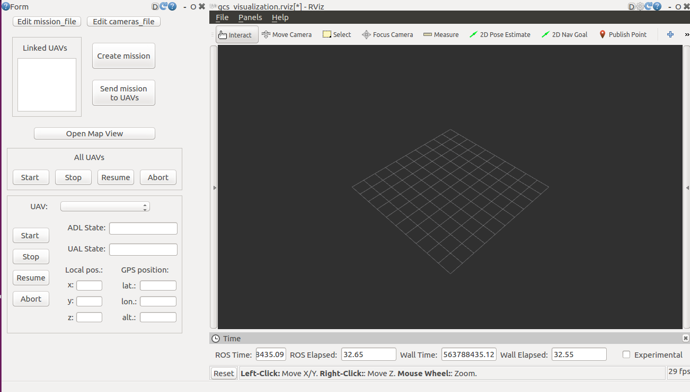
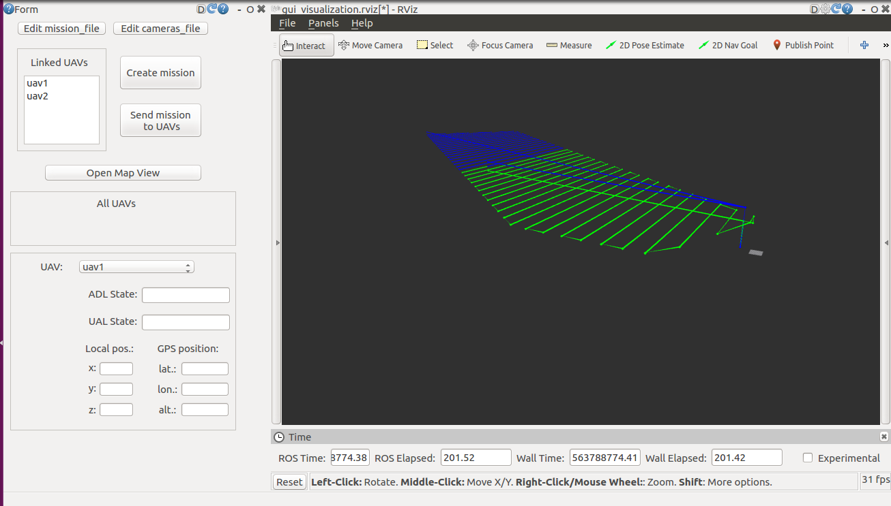
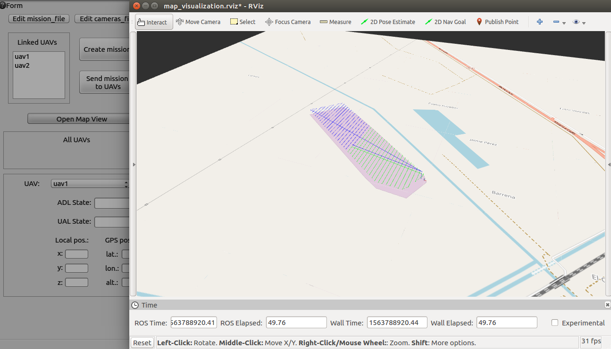

# inspector_gcs

ROS-based software for PV plants inspections. The project is divided into ground and aerial segments.

This is the ground segment, to be installed on the ground control station.

You can find the aerial segment package [here](https://github.com/AlejandroCastillejo/inspector_software_uav)

<br/>

## 

## How to build and install inspector_gcs 

### ROS 

This package is based on ROS Kinetic Kame.

See instructions and install "Desktop-Full" package: 
http://wiki.ros.org/kinetic/Installation/Ubuntu


### Dependencies

Before the current package, some dependencies need to be installed.
 
 * ROS-multimaster-fkie:
    ```
    sudo apt-get install ros-kinetic-multimaster-fkie 
    ```

 * ROStful launcher:
   ```
   sudo apt-get install ros-kinetic-rostful
   ```

 * Other ROS dependencies  
   ```
   sudo apt-get install ros-kinetic-geographic-msgs 
   ```
   
 * Qt5 dependencies: 
    ```
	sudo apt-get install qtbase5-dev
	sudo apt-get install qtpositioning5-dev
    ```

 * sshpass (required for file transfer via scp)
    ```
    sudo apt-get install sshpass
    ```

 * python-pandas (required for data bases)
   ```
   sudo pip install pandas
   ```

### inspector_gcs package
To conclude, clone this repository into your catkin workspace and compile:
```
cd ~/(your catkin_ws)/src
git clone (repository URL)
cd ~/(your catkin_ws)
catkin_make
```

<br/>

## Run inspector_gcs
The following command runs the gcs main node, the GUI and the API REST server node:
```
roslaunch inspector_gcs inspector_gcs.launch 
```

<br/>

## GUI Screenshots
Once the software is launched you will see the following:  
<br/>
 

<br/><br/><br/> 
The following image shows a screenshot of the GUI after two UAVs have been linked and the mission has been created.  
<br/>
 
 
<br/><br/><br/>
You can also see the mission paths over a map by pushing the button "Open Map View":  
<br/>
